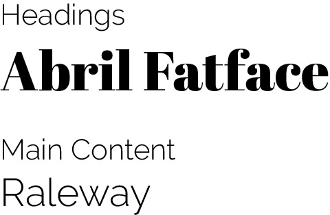

### Project 1

# My-Portfolio Website

[View project on GitHub](https://sara-sundin.github.io/My-Portfolio---Project-1/index.html).

## Introduction

Welcome to my personal portfolio website! This project serves as a platform to showcase my skills, projects, and experience as a freelance designer. I am planning on showcasing this website to future potential employers.

# CONTENT

[USER EXPERIENCE (UX)](#user-experience)
- My website across UX planes
- User Stories
 

[DESIGN](#design)
- Colour Scheme
- Typography
- Imagery
- Wire Frames
- Features
- Accessibility
- Aria labels
 

[TECHNOLOGIES USED](#technologies-used)
- Languages used to create the website
- Frameworks
- Software
- Automated Tools
- ChatGPT
 

[DEPLOYMENT](#deployment)
- GitHub
 

[TESTING](#testing)
- Devices
- Browsers
- Testing Grid
- Chrome Dev Tools
- Lighthouse
- Validators
- Bugs & Fixes
 

[REFERENCES](#references)
- Media References
- Content References
 

[CREDITS](#credits)
- Images
- Code
 

[ACKNOWLEDGMENTS](#acknowledgments)

# USER EXPERIENCE

## My website across UX planes

### Strategy Plane
The primary goal of the website is to showcase my design skills, experience, and projects while making it easy for users to contact me for collaborations or job opportunities. The target audience includes potential clients, employers, and collaborators. The website aligns with their needs by presenting my portfolio, testimonials, and contact options in an organized manner. This detailed approach ensures that the website not only looks good but also meets user needs effectively, creating a seamless and enjoyable experience across all UX planes.

### Scope Plane
The website focuses on must-have features like a welcoming homepage, portfolio section, and contact form, complemented by should-have and could-have features such as featured project previews and a downloadable CV. This balance ensures users have access to essential content while optional features enhance their experience.

### Structure Plane
The site is organized with a logical flow:
- A homepage introduces me and provides quick access to featured projects.
- A portfolio section allows in-depth exploration of my work.
- A contact page facilitates direct communication.
- Clear navigation ensures users can easily find the information they need without confusion.
  
### Skeleton Plane
The layout is clean and minimalist, with responsive grid systems and intuitive placement of elements.
- Key features like the navigation bar, featured projects, and contact form are prominently displayed.
- Buttons, links, and hover effects are designed to guide users naturally through the site.
- The responsive design ensures usability across mobile, tablet, and desktop devices.
  
### Surface Plane
The visual design is professional and appealing, reflecting my style and brand identity.
- Typography and color schemes are consistent and aesthetically pleasing, reinforcing trust and professionalism.
- High-quality images and thumbnails of my work enhance visual engagement.
- Subtle animations, such as hover effects, provide interactivity without overwhelming users.

## User Stories
### First-Time Visitors
Goal: Quickly understand who the designer is and what they do.
- Explore a welcoming homepage with an introduction to the designer (User Story 1).
- View a featured section showcasing selected projects to decide whether to explore further (User Story 5).
- Browse a detailed portfolio to evaluate the designer's skills and experience (User Story 2).
- Easily navigate the website across devices with a responsive design (User Story 4).
### Returning Visitors
Goal: Dive deeper into specific projects or make inquiries.
- Revisit the portfolio to review specific projects of interest (User Story 2).
- Use the contact form to send inquiries about services or collaborations (User Story 3).
- Download the designer’s CV to review qualifications offline (User Story 6).
### Frequent Visitors
Goal: Maintain ongoing trust and share feedback.
- Read client testimonials to validate the designer’s credibility (User Story 7).
- Submit a testimonial to share positive experiences and support the designer (User Story 8).

<h4>User Story 1 (must-have)</h4>

  
### User Story 1 (must-have)
As a visitor, I want to see a welcoming homepage with a brief introduction,  
so that I can quickly understand who the designer is and what they do.

#### Acceptance Criteria
- A prominent welcome message is displayed.
- A short bio section is present with a professional photo.
- Links to the Portfolio and Contact pages are accessible.

#### Tasks
- Design a clean homepage layout.
- Add a welcome message and introductory text.
- Include a professional photo and navigation links.

<h4>User Story 2 (must-have)</h4>

  
### User Story 2 (must-have)
As a potential client, I want to browse a portfolio of design projects so that I can evaluate the designer’s work and decide if I want to hire them.

#### Acceptance Criteria
- The Portfolio page displays thumbnails for at least three projects.
- Each project includes a title, brief description, and larger view option.

#### Tasks
- Create a Portfolio page template.
- Add a grid layout for project thumbnails.
- Include hover effects with links to project details.

<h4>User Story 3 (must-have)</h4>

  
### User Story 3 (must-have)
As a user, I want to send a message from a contact form, so that I can easily inquire about services or collaborations.

#### Acceptance Criteria
- A contact form with fields for Name, Email, and Message is present.
- Form submission sends an email to the designer.
- Confirmation message appears after successful submission.

#### Tasks
- Design a contact form layout.
- Implement form validation for required fields.
- Configure email submission functionality.

<h4>User Story 4 (must-have)</h4>

  
### User Story 4* (must-have)
As a user, I want to navigate the website easily on my device so that I can view content without unnecessary zooming or scrolling.

#### Acceptance Criteria
- The website layout adjusts seamlessly for mobile, tablet, and desktop devices.
- Navigation links remain accessible and functional on all screen sizes.

#### Tasks
- Use responsive design principles (media queries).
- Test the layout on various devices and screen resolutions.

<h4>User Story 5 (should-have)</h4>

  
### User Story 5 (should-have)
As a user, I want to quickly have a look of some examples of work from the designer so that I can decide if I want to explore further.

#### Acceptance Criteria
- A section on the homepage page displays a few featured design projects in a responsive grid of photos.
- Clicking a preview takes the user to a detailed view or the full portfolio page.
- The section is visually appealing and loads quickly.

#### Tasks
- Create a clean and visually appealing grid for displaying featured projects.
- Choose 3–5 images to highlight as examples of the designer’s work.
- Ensure links work properly across devices.
- Check for responsiveness and loading speed.

<h4>User Story 6 (could-have)</h4>

  
### User Story 6 (could-have)
As a potential client I want to download the designer’s CV so that I can review their qualifications and experience offline.

#### Acceptance Criteria
- A download button and/or link is available on the Home and Contact page.
- Clicking the button provides a professionally formatted PDF version of the CV.

#### Tasks
- Add a prominent download button labeled "Download CV" and link it to the PDF file.
- Test the download functionality to ensure the file is accessible.

<h4>User Story 7 (could-have)</h4>

  
### User Story 7 (could-have)
As a possible client I want to read testimonials from previous clients or collaborators so that I can gain trust and confidence in the designer’s skills and professionalism.

#### Acceptance Criteria
- A Testimonials section is present on the Home page.
- Each testimonial includes the client’s name, role, and a brief comment.
- Testimonials are displayed in a visually appealing layout, such as a carousel.

#### Tasks
- Create a design layout for the Testimonials section.
- Implement a database or static content to store testimonials.
- Develop functionality to display testimonials in a structured format (e.g., carousel, cards).
- Add placeholder for the initial launch.
- Test the section for readability and responsiveness on various devices.

<h4>User Story 8 (want-have)</h4>

  
### User Story 8 (want-have)
As a satisfied client or collaborator I want to submit a testimonial to the website so that I can share my positive experience and support the designer’s credibility.

#### Acceptance Criteria
- A form is available for users to submit their testimonial.
- Submissions are reviewed before appearing live on the website.
- A confirmation message is shown after successful submission.

#### Tasks
- Create a simple and intuitive testimonial submission form with necessary fields.
- Store submitted testimonials in a database or as static content (if manually reviewed).
- Display a message like "Thank you for your feedback! Your testimonial will be reviewed and added shortly." upon successful submission.
- Verify that submissions are stored correctly and review functionality works as expected.

# DESIGN
## Colour Scheme

 
 
I have used a retro looking palette for the website that features a sophisticated mix of vibrant and soft tones. The primary colors are deep purple and subtle cream. This palette reflects a balance between boldness and approachability, evoking a sense of creativity and professionalism. It’s a versatile combination that works well for both striking highlights and subtle backgrounds.

## Typography
The chosen typography for my website are both Google fonts and combines Abril Fatface for headings and Raleway for the main content. The combination of these fonts enhances the user experience by drawing attention to key elements (headings) while maintaining clarity and readability for longer text sections.

Abril Fatface: This typeface exudes elegance and sophistication with its bold, high-contrast design, making it ideal for attention-grabbing headings, perfectly complementing my design-focused website.

Raleway: A modern sans-serif font known for its clean and minimalistic design, Raleway ensures excellent readability for the main content. Its versatility and subtle elegance balance the boldness of Abril Fatface, creating a cohesive and polished aesthetic throughout the site.

## Imagery
The images are either photographed by myself or with permission from their owners. I have included these owners in the credits section.

## Wire Frames
The wireframes were created in Illustrator for mobile, tablet and desktop. I developed my own toolkit to use for future wireframes.

<h4>Home Page Wireframe</h4>

<h4>Project Pages Wireframe</h4>

<h4>Contact Form Wireframe</h4>

<h4>Success Page Wireframe</h4>

## Structure of the website

The website features six pages that are accessible from the navigation bar (home page, project pages, contact form. There is also a success page that displays once the user has filled in and pressed sent on the contact form.

### Headings

#### Home Page
- Title Heading: "Sara Sundin / Creative Developer
- Main Heading (h1): "Creative Developer"
- Subheadings (h2): "Design & Fashion"
- Subheadings (h3): "About Me, Projects"
- Subheadings (h4): Portfolio Section "IKNW, Mini goes Wild, KA_YO_Prototype, Illustrations"
- Subheadings (h4): "Let's Connect"

#### Portfolio Pages
- Main Heading (h1): Main project "IKNW, Mini goes Wild, KA_YO_Prototype, Illustrations"
- Subheadings (h3): "Projects"
-  Subheadings (h4): Portfolio Section "IKNW, Mini goes Wild, KA_YO_Prototype, Illustrations"
- Subheadings (h4): "Let's Connect"

#### Contact Page
- Main Heading (h1): "Let's Connect."

#### Success Page
- Main Heading (h1): "Your message has been sent."

## Features on all pages

### Favicon
I have generated a favicon at Favicon.io using the initials in my name (SS).

### Navigation Bar
All pages on the website has a navigation bar for easy access to all pages. The navigation bar is responsive and the menu transforms into a toggle tool when viewing the page on a mobile device and screens under 768px. The navigation bar was added with Bootstrap and customized using CSS. The navbar is fixed to the top.

<h4>Navigation Bar Image - Desktop</h4>

<h4>Navigation Bar Image - Mobile</h4>

### Buttons
All pages except the contact form and success page has two sections with action buttons that links to the contact form. The first button section including some text and the second button being more plain. Both button sections are responsive on all screens.

<h4>Contact section/button with text - Desktop Image</h4>

<h4>Contact section/button with text - Mobile Image</h4>

<h4>Contact section/button plain - Desktop Image</h4>

<h4>Contact section/button plain - Mobile Image</h4>

### Footer
All pages has a footer that is responsive for all screens. The footer includes links to home, projects and contact form. At the bottom are three social media icons added with Font Awesome.

<h4>Footer Image</h4>

## Features page by page

### Home Page
An introduction section to who I am and my professional background. This page also include a responsive portfolio section with overview of the projects, a carousel at the bottom with testimonials as well as the two action buttons to the contact form. All sections use Bootstrap responsive styling.

<h4>About Me Section - Desktop Image</h4>

<h4>About Me Section - Mobile Image</h4>

<h4>Portfolio Section - Tablet Image</h4>

<h4>Portfolio Section - Desktop Image</h4>

<h4>Testimonial Section - Mobile Image</h4>

### Project Pages
A collection of my work, highlighting design projects I have completed. All four project pages has the same structure with an introductory text, a responsive gallery section, an portfolio section to easily navigate to other projects and the two action buttons to the contact form. The gallery and portfolio section use Bootstrap responsive grids.

<h4>Introductory text - Mobile Image</h4>

<h4>Gallery- Desktop Image</h4>

<h4>Portfolio Section - Tablet Image</h4>

### Contact Page 
A contact form and a success page for potential clients and collaborators to reach out to me. This page includes a section with text with information and a form added with Bootstrap.

<h4>Informational text - Tablet Image</h4>

<h4>Contact form - Mobile Image</h4>

### Success Page 
A success page that confirms that a user’s message has successfully been sent to provide reassurance. The page includes a responisive section with text and an image of a sent icon.

<h4>Success text - Desktop Image</h4>

### Future Pages 
Possibility for users to add testimonials directly on the site using a form. This will also include a success page to confirm the testimonial is being reviewed. There will also be more project pages added once projects are completed. Another feature could be a blog for users to see information and sneekpeeks of current projects that has not yet been completed.

## Accessibility
The following measures has been taken to make sure the website is accessible.
- Semantic Elements: Elements like header, main, and footer are used to provide clear structure, making it easier for screen readers to interpret content.
- Descriptive Headings: Properly structured heading levels (e.g., h1, h2, h3) to create a logical document outline.
- Alt Attributes: Every image includes meaningful alt text, ensuring visually impaired users understand the content.
- Focusable Elements: Navigation links, buttons, and forms are fully accessible using only the keyboard (e.g., via tab and enter keys).
- High Contrast: Text and background colors are chosen to meet the standards.
- Flexible Layouts: The website is fully responsive, ensuring accessibility across various devices, including desktops, tablets, and smartphones.
- Viewport Meta Tag: Ensures proper scaling and readability on mobile devices.
- Labels for Form Fields: All form fields include <label> tags or appropriate aria-label attributes to guide users through form completion.
- ARIA labels: Aria roles are added where necessary to define regions of the page for assistive technologies.
- Readable Fonts: Fonts like Raleway are legible with sufficient size and line spacing for comfortable reading.
- Scalable Text: Text can be resized without loss of content or functionality.
- Accessibility Testing Tools: Lighthouse has been used to identify and address accessibility issues.

## ARIA Labels Used

### Toggle Navigation Button:
aria-controls="navbarSupportedContent"
 
aria-expanded="false"
 
aria-label="Toggle navigation"
### Dropdown Menu:
aria-expanded="false"
 
aria-labelledby="projectsDropdown"
### Download CV Link:
aria-label="Download my CV in PDF format"
### Portfolio Section:
aria-label="Portfolio section showcasing design projects"
### Carousel Indicators:
aria-current="true"
 
aria-label="Slide 1" (and similar for other slides)
### Carousel Controls:
aria-label="Previous"
 
aria-label="Next"
### Gallery Section:
aria-label="Gallery"
### Contact Section:
aria-label="Contact form"
### Footer Links:
aria-label="Navigate to the home page"
 
aria-label="Navigate to the portfolio"
 
aria-label="Navigate to the contact page"
### Social Media Links:
aria-label="Visit my Instagram page (opens in a new tab)"
 
aria-label="Visit my LinkedIn page (opens in a new tab)"
 
aria-label="Connect on Whatsapp (opens in a new tab)"

# TECHNOLOGIES USED
## Languages Used to Create the Website
- HTML
- CSS
- JavaScript
## Frameworks and Libraries
- Bootstrap (for responsive design and styling)
- Font Awesome (for icons)
- Google Fonts (for typography)
- Favicon.io (to create and manage favicons)
- Iloveimg.com (to compress images for faster loading)
## Software
- Adobe Illustrator (for wireframes and hero image creation)
- Adobe Photoshop (for image editing and optimization)
- Git (for version control)
- GitHub (to save and store the website's code and files)
## Automated Tools
- Chrome DevTools (for debugging and testing)
- Lighthouse (to analyze performance, accessibility, and SEO)
- Am I Responsive (to test responsive design on various devices)
- W3C HTML & CSS Validator (to validate and check for coding errors)
- Techsini.com (for multidevice image and testing responsiveness)
## ChatGPT
I have used ChatGPT throughout the process as a sparring partner for ideas, troubleshooting, and problem-solving.

# DEPLOYMENT

## Ensure your website files (HTML, CSS, JavaScript, etc.) are committed to a GitHub repository.
- Go to Repository Settings
- Navigate to the repository on GitHub.
- Click on the Settings tab.
- Enable GitHub Pages
- Scroll down to the Pages section.
- Under "Branch," select the branch you want to deploy (typically main or master).
- Click Save.

## Access Your Website
After a few moments, GitHub Pages will generate a URL for your site (e.g., https://username.github.io/repository-name).
Visit this URL to view your deployed website.

<h4>GitHub Deployment Page</h4>

# TESTING
## Devices
### The testing on the site has been made on four different devices:
Samsung Galaxy Mobile A25  
Apple IPad Mini  
Apple IPad   
Lenovo Desktop 15"  

## Browsers
### The different browsers used for testing:
Google Chrome  
Microsoft Edge  
Safari  
Firefox  
Samsung Internet  

## Testing grid
I have used a grid for testing all components of the website. After testing I have fixed any issues arising and put a note in the grid what has been done. See below dropdown menu for the grid that I created in an excel spreadsheet using a free template as base. [Link to excel spreadsheet](assets/files/Test_Checklist.xlsx)

<h4>Testing Grid</h4>

## Chrome Dev Tools
I have used Dev Tools throughout the development of the website to test for responsiveness and troubleshooting. 

## Lighthouse
I used Dev Tools Lightouse to help improve the website's performance, accessibility, SEO, and user experience. The first time I ran the testing I received messages for some of the pages for improvement I have recorded above each page below. The Lighthouse tool provided actionable insights to optimize speed and fix issues. After fixing the issues all areas turned green.

### Home Page
Improvement messages: 
- Organise the headings for better accessability
- Optimise the images further for better performance.

<h4>Home Page Second run - after fixing the issues</h4>

### Project 1 Page 

<h4>Project Page 1 First run</h4>

### Project 2 Page 
Improvement message:
- optimise the images further for better performance.

<h4>Project Page 2 Second run - after fixing the issues</h4>

### Project 3 Page
Improvement message:
- optimise the images further for better performance.

<h4>Project Page 3 Second run - after fixing the issues</h4>

### Project 4 Page 

<h4>Project Page 4 First run</h4>

### Contact Page 

<h4>Contact Page First run</h4>

### Success Page

<h4>Contact Page First run</h4>

## Validation
The HTML and CSS code has been validated on below editors. The issues arising has been recorded in the dropdown menus.

## W3C HTML Validator
I have included screenprints of the first and final validation of the HTML with W3C validation on all pages. Mostly I needed to remove spaces from the images.
 

### Home Page Fixes

<h4>Home Page-Initial Check </h4>

- remove spaces from images

<h4>Home Page-Final Check </h4>

### Project Page 1 Fixes

<h4>Project Page 1-Initial Check </h4>

- remove spaces from images
 
- added aria label on gallery
 
- added main opening tag

<h4>Project Page 1-Final Check </h4>

### Project Page 2 Fixes

<h4>Project Page 2-Initial Check </h4>

- remove spaces from images
 
- added aria label on gallery
 
- added main opening tag

<h4>Project Page 2-Final Check </h4>

### Project Page 3 Fixes

<h4>Project Page 3-Initial Check </h4>

- remove spaces from images
 
- added aria label on gallery
 
- added main opening tag

<h4>Project Page 3-Final Check </h4>

### Project Page 4 Fixes

<h4>Project Page 4-Initial Check </h4>

- remove spaces from images
 
- added main opening tag

<h4>Project Page 4-Final Check </h4>

### Contact Page Fixes

<h4>Contact Page-Initial Check </h4>

- added aria label for contact form
 
- removed attribute type

<h4>Contact Page-Final Check </h4>

### Success Page Fixes

<h4>Success Page-Initial Check </h4>

- no fixes

### W3C CSS Validator
The CSS was succesfully validated.

### Bugs & Fixes
Here I have recorded some issues that I spent excessive time solving with the solutions indicated below.

#### There is a gap between the footer and carousel on home page.

<h4>Image</h4>

#### Solution
After many hours I ran the whole code through ChatGPT and it turned out there was a missing section opening tag for the porfolio section above. It did not seem related so I did not look at this section to begin with. In the end it was just a simple mistake.

<h4>Code</h4>

### Dropdown menu does not close on home page when using "All Projects" link on mobile.

<h4>Image</h4>

#### Solution (partly unfixed)
I could not find a solution to keep the link for the projects to the home page section for the portfolio projects so I moved the link to one of the project pages that also had a section to showcase all projects.

<h4>Code</h4>

# REFERENCES

## Media References
- Youtube video creating your first README with Kera Cudmore
- Youtube video testing with Kasia Bogucka

## Content References
- Cheat sheet Read Me: https://docs.github.com/en/get-started/writing-on-github/getting-started-with-writing-and-formatting-on-github/basic-writing-and-formatting-syntax
- Read Me example: https://github.com/amylour/scoops_pp1
- Free Download Template for website checking from https://www.hubspot.com
- Code Institute Tutorials and Learning Content

# CREDITS
- Adobe Stock Photo for writing pen image
- KA_YO Photos in Porfolio permitted usage from KA_YO
- Photos for Five Seasons - taken by myself
- Photograpers IKNW photos (except myself) Marcus Grip & Johan Eriksson
- The Javascript for closing navbar from Code Institute
- Code Institute (I have used small snippets of code in the source code for Love Running and Boardwalk Games projects in the gallery section and contact form.
- I have used ChatGPT for problem solving and ideas throughout the project.

# ACKNOWLEDGMENTS
I want to thank my mentor Rory Patrick who organized to have the final mentor session for the project even though he was on holidays. Also a big shout out to the Slack community at Code Institute and the peers who are always eager to help out.

